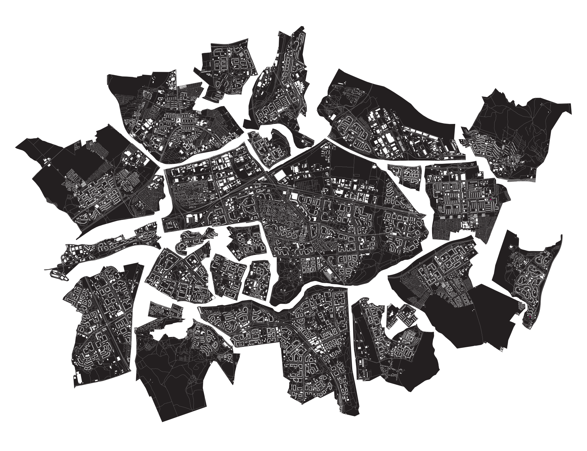

Aufbau Ost
================
Jonas Schöley

I created a mosaic of East German „Plattenbau“ districts. Growing up in such a place I was fascinated by the circuit board like layout of streets and buildings. Today I feel familiarity and nostalgia but also a sense of dystopia when visiting those impressive urban landscapes.

